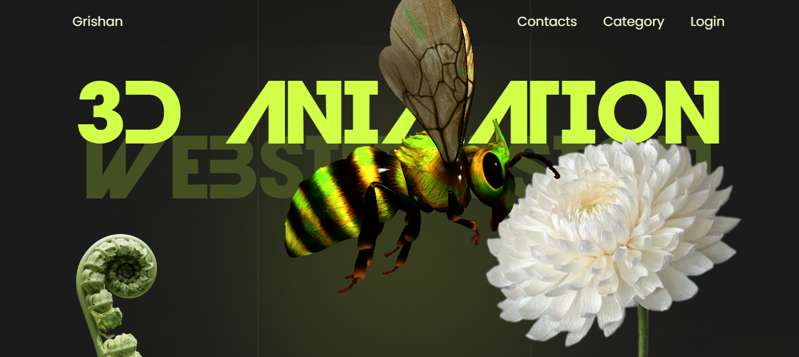

# Amazing 3D Animation Website
# Удивительный веб-сайт с 3D-анимацией

## HTML, CSS, JS, Three.Js

## Создание чрезвычайно интересной анимации в момент прокрутки страницы пользователем с помощью библиотеки Three.js 

## Creating an extremely interesting animation when the user scrolls the page using the library Three.js

Three.js это библиотека JavaScript с открытым исходным кодом, которая упрощает процесс создания 3D-графики в Интернете. Созданный на основе WebGL (веб-стандарта для рендеринга 2D и 3D графики), Three.js он позволяет абстрагироваться от многих сложностей, связанных с 3D-программированием, делая его доступным как для начинающих, так и для опытных разработчиков. С помощью Three.js вы можете создавать сложные сцены, анимации и интерактивные приложения, которые без проблем работают в любом современном веб-браузере.

Three.js is an open-source JavaScript library that simplifies the process of creating 3D graphics on the web. Built on top of WebGL (a web standard for rendering 2D and 3D graphics), Three.js abstracts many of the complexities involved in 3D programming, making it accessible for both beginners and experienced developers. With Three.js, you can create intricate scenes, animations, and interactive experiences that run smoothly in any modern web browser.

